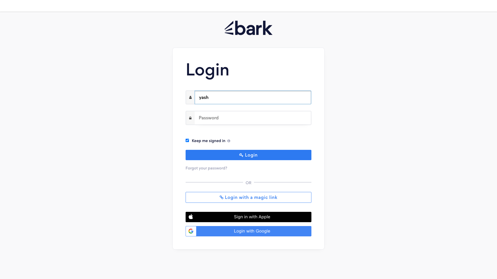

<div align="center">
  <h1>🤖 Bark AI Agent</h1>
  <p><b>Autonomous Lead Scraping, AI Qualification, & Automated Pitch Pipeline</b></p>
  <p>A Python-powered AI Agent engineered to autonomously browse Bark.com, extract service leads, evaluate semantic fit using NVIDIA's Llama 3.1 70B, and formulate highly-personalized sales pitches.</p>

  <p>
    
    
    
    
  </p>
</div>

---

## 📖 Introduction
The **Bark AI Agent** is an autonomous sales qualification system. Designed for high-volume service providers, agencies, and freelancers, it completely automates the top-of-funnel lead assessment process. Instead of manually scrolling through Bark.com, reading buyer requests, and writing manual cover letters, this agent does it all while maintaining a highly personalized, human touch.

---

## 🚀 Features

| Feature | Description |
| :---: | :--- |
| 🕵️ | **Autonomous Navigation** <br> Bypasses basic headless detection using Playwright to render Bark.com and smoothly extract dynamic DOM elements. |
| 🧠 | **Intelligent Qualification** <br> Fast, deterministic ICP (Ideal Customer Profile) scoring utilizing NVIDIA's Llama 3.1 70B via the OpenAI SDK. |
| ✍️ | **Contextual Communicator** <br> GenAI drafts 3-paragraph pitches organically embedding distinct, verifiable data points from the buyer's strict request. |
| 🗂️ | **Automated Outbox** <br> Successfully qualified leads are automatically saved as ready-to-send `.txt` proposals. |

---

## 🎬 Live Walkthrough & Demo

This system natively leverages Playwright's browser automation capability to autonomously log into your dashboard, await asynchronous content hydration, and extract lead data directly from the DOM!

### Dashboard Extraction Screenshot
Here is a snapshot of the Chromium browser safely navigating past the authentication portal into the Bark Dashboard:



### Auto-Generated Proposal Demonstration
Based on the Lead input, the NVIDIA model evaluates if the budget constraints match the ICP. If the score exceeds `0.8`, the Agent organically drafts a hyper-contextual cover letter into the `outbox/` directory:

```text
[Communicator] Drafting highly contextual proposal for L-1001 via NVIDIA API...
✅ Contextual proposal safely drafted to outbox/L-1001_proposal.txt

--- Generated Cover Letter ---
Hi there! I noticed your buyer request on Bark detailing your need for a bespoke headless WordPress solution, and I was immediately drawn to the project. Your requirement for seamless integration with a custom HubSpot CRM aligns perfectly with our agency's core expertise.

Our engineers specialize in high-performance headless architecture utilizing Next.js as the front-end layer for WordPress. By decoupling the CMS, we can guarantee lightning-fast load times for your boutique agency's client. Additionally, we have extensive experience mapping complex data structures straight into HubSpot via their API, ensuring your marketing automation workflows remain uninterrupted and highly tailored to your new site.

Given your stated budget of $5,500+, we have more than enough scope to architect a premium, scalable solution that exceeds your client's expectations without compromising on speed or security. I'd love to schedule a brief discovery call this week to walk you through similar headless CRM integrations we've successfully deployed. Let me know what day works best!
------------------------------
```

### 📹 Full Execution Video
You can watch the fully automated headless-browser extraction and LLM pipeline [right here in our demo video](./assets/demo_video.webm)!

---

## 🛠️ Tech Stack

**Backend / Automation**
- `Python 3.11`
- `Playwright` (Chromium Automation & Networking Interception)
- `python-dotenv` (Credentials Management)

**AI / Machine Learning**
- `NVIDIA NIM` (Host Environment)
- `Llama 3.1 70B Instruct` (Model)
- `OpenAI Python SDK` (API Interface)

---

## ⚙️ Getting Started

Follow these instructions to safely run the AI Agent on your local machine.

### Prerequisites
- Python 3.9+
- An [NVIDIA AI Platform](https://build.nvidia.com/explore/discover) API Key.

### Installation

**1. Clone the repository**
```bash
git clone https://github.com/kalkidevs/Mini_ai_agent.git
cd Mini_ai_agent
```

**2. Create a virtual environment**
```bash
python3 -m venv venv
source venv/bin/activate  # Windows: venv\Scripts\activate
```

**3. Install dependencies**
```bash
pip install -r requirements.txt
playwright install chromium
```

### Environment Setup
Rename the `.env.example` file to `.env` and configure your credentials:
```text
BARK_EMAIL=your_email@example.com
BARK_PASSWORD=your_password
NVIDIA_API_KEY=nvapi-your_secret_key_here
```

### Run Commands
Trigger the complete agent pipeline:
```bash
python main.py
```
> **🌟 Tip:** By default, the application runs in *Mock Mode* to instantly demonstrate logic flow. Open `main.py` and change the parameter to `mock_mode=False` to trigger the complete, live Chromium automation that actually browses the web!

---

## 📂 Project Structure

```text
📦 Mini_ai_agent
 ┣ 📂 assets/                 # Demo screenshots & videos
 ┣ 📂 outbox/                 # Generated LLM sales pitches
 ┣ 📜 .env                    # Secure credential storage (Git-ignored)
 ┣ 📜 .gitignore              # Dependency & secrets whitelist
 ┣ 📜 README.md               # You are here
 ┣ 📜 brain.py                # Handles Semantic Qualification & Scoring
 ┣ 📜 communicator.py         # Handles 3-paragraph context generation
 ┣ 📜 main.py                 # Core orchestration execution layer
 ┣ 📜 requirements.txt        # PIP dependencies
 ┗ 📜 scraper.py              # Playwright DOM interaction logic
```

---

## 🤝 Contributing

We welcome contributions to strengthen our web un-blocking heuristics or augment our AI prompting models! 

1. **Fork** the repository
2. **Create** your feature branch (`git checkout -b feature/AmazingFeature`)
3. **Commit** your changes (`git commit -m 'Add some AmazingFeature'`)
4. **Push** to the branch (`git push origin feature/AmazingFeature`)
5. Open a **Pull Request**

---

## 📄 License
Distributed under the MIT License. See `LICENSE` for more information.

---

<div align="center">
  <strong>Built with ❤️ by KalkiDevs</strong>
  <br>
  If you found this project helpful, please consider giving it a ⭐!
</div>
