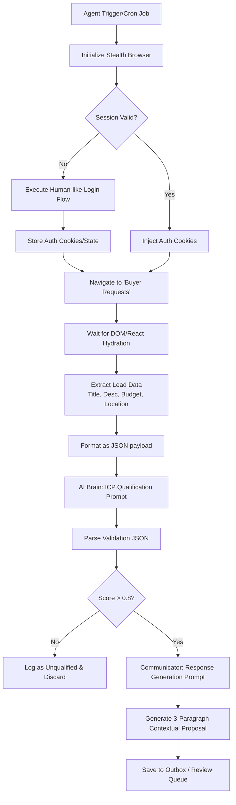

# Bark.com Autonomous AI Agent - Proof of Concept Specification

This document details the architectural design, technical roadmap, and implementation constraints for building an autonomous AI agent engineered to systematically discover, filter, and draft customized responses to service leads on Bark.com.

## Architectural Flowchart

The following diagram outlines the end-to-end data flow and logical decisions made by the agent.



---

## 1. Autonomous Web Navigation & Data Acquisition (The 'Scraper')

### Technology Stack Recommendation
**Recommendation:** **Python with Playwright** (paired with `playwright-stealth`).
**Justification:** While Selenium is an industry veteran, Playwright is inherently superior for modern, highly dynamic Single Page Applications (SPAs) like Bark.com. It natively features **auto-waiting** for elements to be attached, visible, and stable, reducing the need for brittle explicit waits. Furthermore, Playwright allows for direct interception of Network Requests—often allowing you to bypass DOM scraping entirely by intercepting the raw JSON payloads from Bark's underlying GraphQL or REST API calls.

### Process Detail
1.  **Secure Login:** Maintain browser context state (cookies, local storage) across sessions to minimize login events. If logging in is required, type credentials using random human-like delays (e.g., 50ms - 150ms between keystrokes) rather than pasting them instantly.
2.  **Dynamic Content Observation:** Instead of `time.sleep()`, use `page.wait_for_selector('.lead-card-container', state='visible')` to ensure JavaScript rendering is complete. Alternatively, use `page.wait_for_response()` to wait for the specific backend API call that populates the leads.
3.  **Reliable Data Extraction:** Utilize robust, hierarchical Locators.
    *   *Title:* `Locator(".lead-title > h3")`
    *   *Description:* `Locator(".lead-description-text")`
    *   *Budget:* `Locator("[data-test-id='lead-budget']")`
    *   *Location:* `Locator(".location-badge")`

### Anti-Detection Strategy
Simple `time.sleep()` is easily flagged by modern WAFs (Web Application Firewalls) like Cloudflare or Datadome.
*   **Stealth Plugin:** Implement `playwright-stealth` to mask automated browser signatures (e.g., spoofing `navigator.webdriver`, modifying `User-Agent`, fixing WebGL fingerprints).
*   **Human-Like Interactions:**
    *   *Mouse Movements:* Use libraries like `ghost-cursor` to generate bezier-curve, randomized mouse movements rather than snapping coordinates instantly.
    *   *Scrolling Behavior:* Implement smooth, step-based scrolling with randomized pauses to simulate reading behavior.
    *   *Pacing:* Replace static delays with Gaussian distributed randomized delays (e.g., `delay = random.gauss(mu=3.0, sigma=0.5)`).

---

## 2. Intelligent Qualification & Scoring (The 'AI Brain')

### LLM Selection & Integration
**Recommendation:** **Claude 3.5 Sonnet** or **GPT-4o**.
**Justification:** For this PoC, Claude 3.5 Sonnet is highly recommended. It exhibits exceptional instruction-following capabilities, strict adherence to generating valid JSON arrays/objects without markdown backticks (critical for programmatic parsing), and superior nuanced reasoning for complex ICP matching.

### Ideal Customer Profile (ICP) Definition
*"High-end bespoke WordPress/Headless CMS development projects requiring integration with an external CRM, with a stated budget exceeding $2,500 USD."*

### Scoring Logic Formalization Prompt
To ensure the LLM outputs exact, system-parsable JSON, use the following System/User prompt structure.

**System Prompt:**
```text
You are an elite Sales Qualifications Engine. Your sole purpose is to evaluate incoming service leads against a strict Ideal Customer Profile (ICP) and output your evaluation as a strictly formatted, valid JSON object. Do not output markdown, explanations, or any text outside of the JSON object.

THE IDEAL CUSTOMER PROFILE (ICP):
"High-end bespoke WordPress/Headless CMS development projects requiring integration with an external CRM, with a stated budget exceeding $2,500 USD."

SCORING RUBRIC (0.00 to 1.00):
- 1.00: Perfect match (High budget, bespoke CMS/WordPress, CRM integration specifically requested).
- 0.80 - 0.99: Strong match (High budget, CMS/WordPress, but CRM integration implies or is negotiable).
- 0.50 - 0.79: Partial match (Needs CMS but budget is borderline, or budget is high but platform is ambiguous).
- 0.00 - 0.49: Poor match (Low budget, simple template work, no CRM needs, e-commerce only like Shopify).

JSON SCHEMA TO RETURN:
{
  "lead_id": "string",
  "qualification_score": 0.00,
  "justification": "string (1 sentence maximum)"
}
```

**User Prompt:**
```text
Evaluate the following lead based on the ICP:

Lead ID: {scraped_lead_id}
Title: {scraped_title}
Budget: {scraped_budget}
Location: {scraped_location}
Description: {scraped_description}

Provide the JSON evaluation.
```

---

## 3. Contextual Response Generation (The 'Communicator')

### Trigger Condition
This module is executed exclusively if the parsed JSON from the AI Brain returns a `"qualification_score"` stricly greater than `0.8` (`> 0.8`).

### Prompt Engineering Requirement
The goal here is to dynamically generate a persuasive, highly personalized pitch that proves the sender actually read the brief.

**System Prompt:**
```text
You are an expert technical sales executive. Your goal is to draft a highly personalized, persuasive proposal response to a qualified lead.

CONSTRAINTS & RULES:
1. The response MUST be exactly three paragraphs long.
2. Paragraph 1: An engaging hook establishing relevance.
3. Paragraph 2: Our specific technical approach to their problem.
4. Paragraph 3: A soft call-to-action (CTA) to schedule a brief discovery call.
5. NON-NEGOTIABLE CORE REQUIREMENT: You MUST identify and seamlessly integrate at least TWO distinct, verifiable data points directly extracted from their Lead Description (e.g., quoting a specific feature they asked for, referencing their current tech stack, or acknowledging their timeline/budget constraints). Use these data points organically to prove we read their brief.

Do not include a Subject Line. Do not include placeholder text like "[Your Name]". Just output the three-paragraph body text.
```

**User Prompt:**
```text
Draft a proposal for this exact requested project:

Title: {scraped_title}
Budget: {scraped_budget}
Description: {scraped_description}
AI Brain Justification for Qualification: {parsed_justification_from_previous_step}
```

### Output Format
The resulting output will be a clean, human-readable string containing exactly three paragraphs. It relies on no Markdown formatting, allowing it to be safely injected via Playwright into Bark.com's response text area, or securely queued in a database for a human Sales Development Representative (SDR) to review and approve prior to sending.
